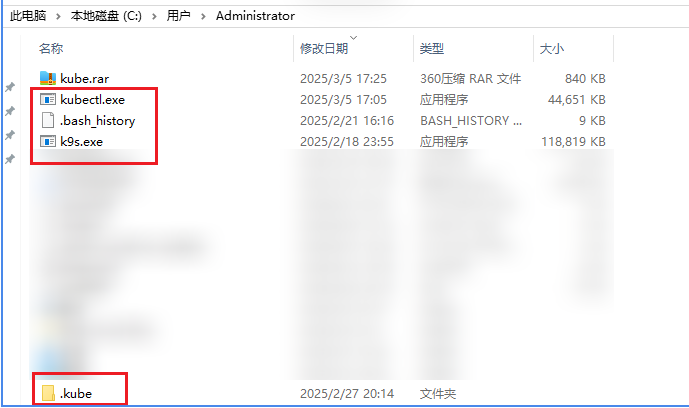
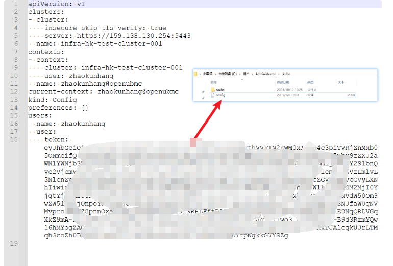
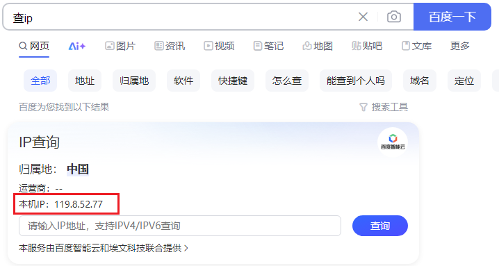
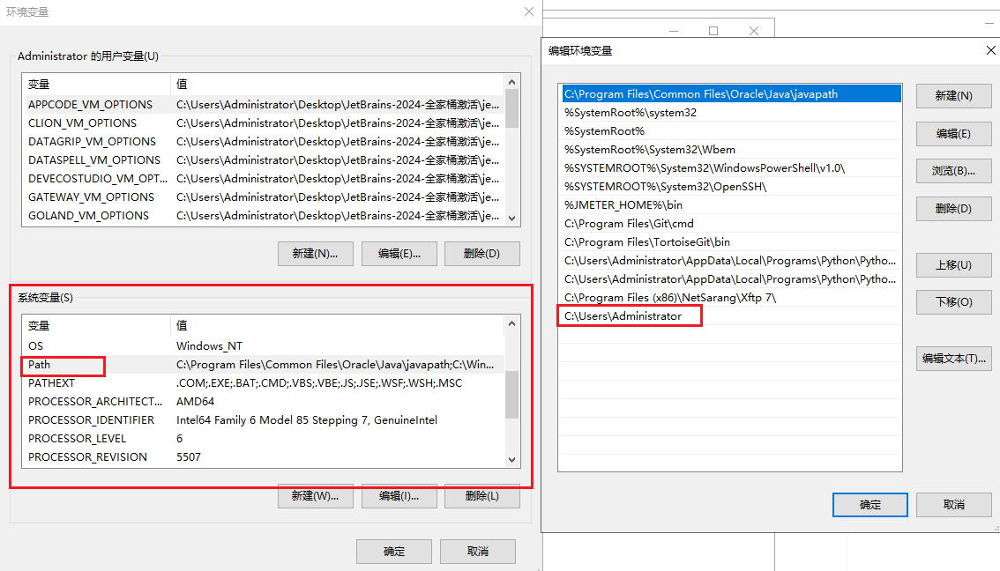
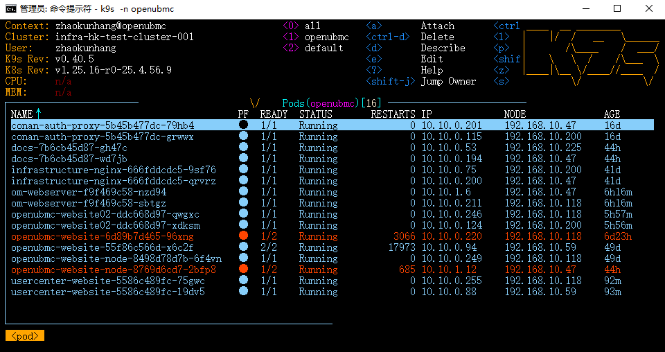
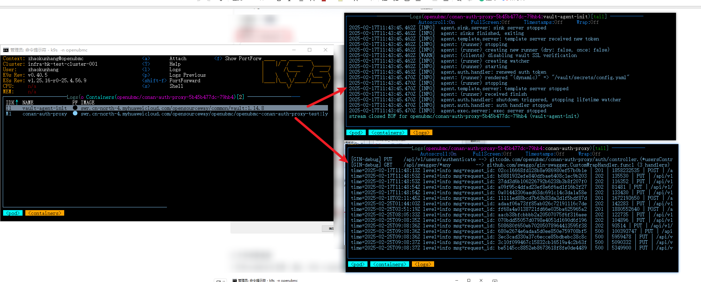

#### 一 安装下载
- 1 下载k9s  https://github.com/derailed/k9s/releases
下载链接：https://github.com/derailed/k9s/releases/download/v0.40.5/k9s_Windows_arm64.zip
- 2 下载kubectl  http://kubernetes.p2hp.com/docs/tasks/tools/install-kubectl-windows.html
下载链接：https://dl.k8s.io/release/v1.25.0/bin/windows/amd64/kubectl.exe
- 3 下载配置文件以及.kube文件夹
链接: https://pan.baidu.com/s/17Ilczj48XUy2uYWrajEUkw?pwd=q38q 提取码: q38q

#### 二 配置修改
- 1 将k9s、kubectl、.kube解压至C:\Users\Administrator 路径下
- 
- 2 将一.3下载的openubmc.txt中的内容，复制到.kube——config文件内(原有config文件内容全部清空)
- 
注：本文档是以openubmc为例编写，所以后续需要检视其他项目文件时，config文件的内容需要替换至相应项目的。
- 3  百度搜索“查ip”，将公网ip，同步至运维(曹亚楠)加白
- 
  4 添加系统环境变量，将C:\Users\Administrator ，添加至系统变量中
  
三 文件权限检查
1 打开cmd命令行工具 ，输入：k9s -n openubmc，配置成功后会打开k9s

2 选择需要检查的服务 按下enter 可选择vault日志和服务日志，再按下enter 可以查看日志

3 返回至k9s主界面，可以按S可以进入到容器内部，然后使用Linux命令，可查看文件权限。不同文件的权限，有不同的标准，具体需要参考团队/公司 对文件权限的管控标准，以下标准仅供参考
文件类型
设置值

用户主目录
750(rwxr-x---)

程序文件(含脚本文件、库文件等)
550(r-xr-x---)

程序文件目录
550(r-xr-x---)

配置文件
640(rw-r-----)

配置文件目录
750(rwxr-x---)

日志文件(记录完毕或者已经归档)
440(r--r-----)

日志文件(正在记录)
640(rw-r-----)

日志文件目录
750(rwxr-x---)

Debug文件
640(rw-r-----)

Debug文件目录
750(rwxr-x---)

临时文件目录
750(rwxr-x---)

维护升级文件目录
770(rwxrwx---)

业务数据文件
640(rw-r-----)

业务数据文件目录
750(rwxr-x---)

密钥组件、私钥、证书、密文文件目录
700(rwx------)

密钥组件、私钥、证书、加密密文
600(rw-------)

加解密接口、加解密脚本
500(r-x------)

