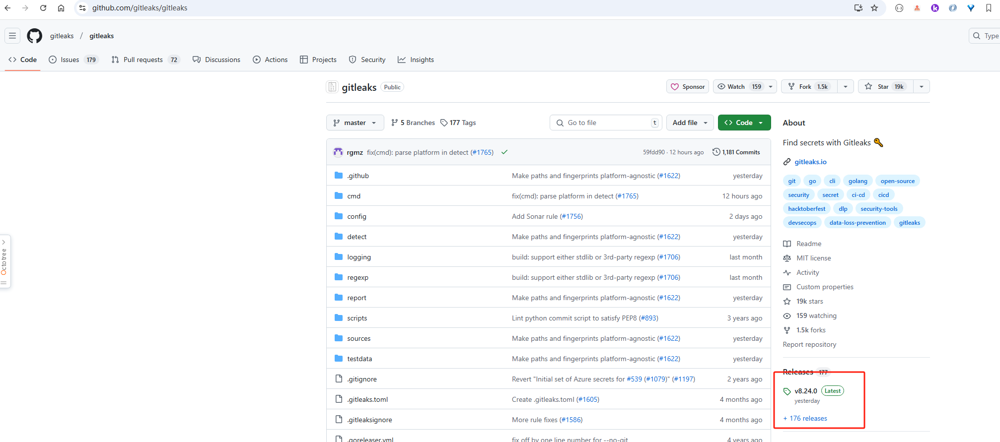
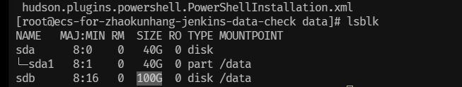
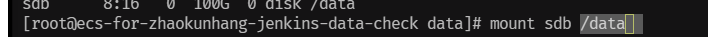

### gitleaks扫描ECS机器Jenkins日志文件敏感信息

1. 准备环境
   1. 找运维 申请临时ECS机器，需要扫描的磁盘备份， 并在安全组添加我们本地的IP。
2. 扫描工具 gitleaks （github）---下载对应版本



3.开发机登录ECS机器，并挂载数据磁盘

  先查到待挂载磁盘名称 lsblk



再新建一个挂载目录 /data  (mkdir) 

再挂在磁盘 mount sdb /data

待扫描数据在 /data/jobs

5.根目录新建 scan.sh
---
```shell
#!/bin/bash

# 定义根目录和结果目录
ROOT_DIR="/data/jobs"
RESULT_DIR="/gitleaks"

# 遍历 /data/jobs 下的所有子文件夹
for dir in "$ROOT_DIR"/*/; do
    # 去掉路径末尾的斜杠，获取文件夹名
    dir_name=$(basename "$dir")
    if [ -f "$RESULT_DIR/result_${dir_name}.json" ];then
        echo "文件已存在：${dir_name}"
        continue
    else
        echo "$RESULT_DIR/result_${dir_name}.json"
        echo "文件不存在：${dir_name}"
    fi

    # 进入子文件夹
    cd "$dir" || { echo "无法进入目录: $dir"; continue; }

    # 执行 gitleaks 命令，结果保存到 /gitleaks/result(文件夹名).json
    result_file="$RESULT_DIR/result_${dir_name}.json"
    /gitleaks/gitleaks dir ./ --report-path "$result_file"

    # 打印日志
    if [ $? -eq 0 ]; then
        echo "已完成: $dir -> $result_file"
    else
        echo "失败: $dir"
    fi
done
```

6.执行扫描脚本 sh xx.sh

7.扫描结果回传到开发机

8.结果分析 回传内网 内网分发整改


