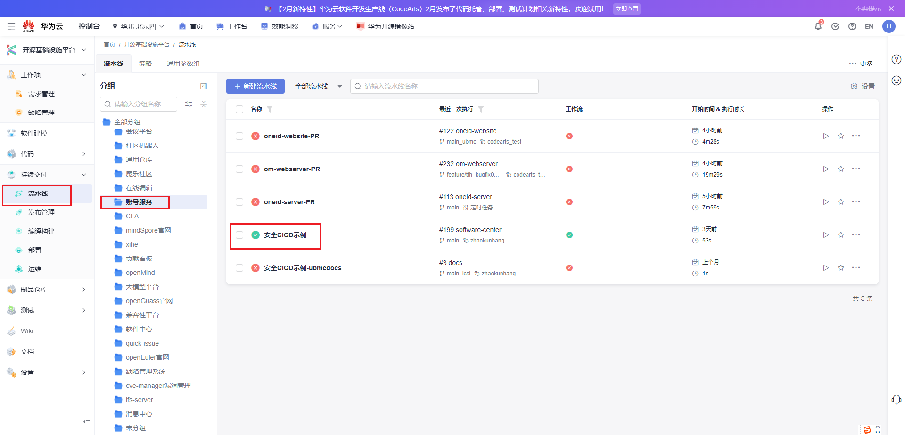
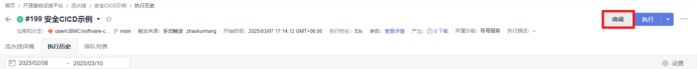
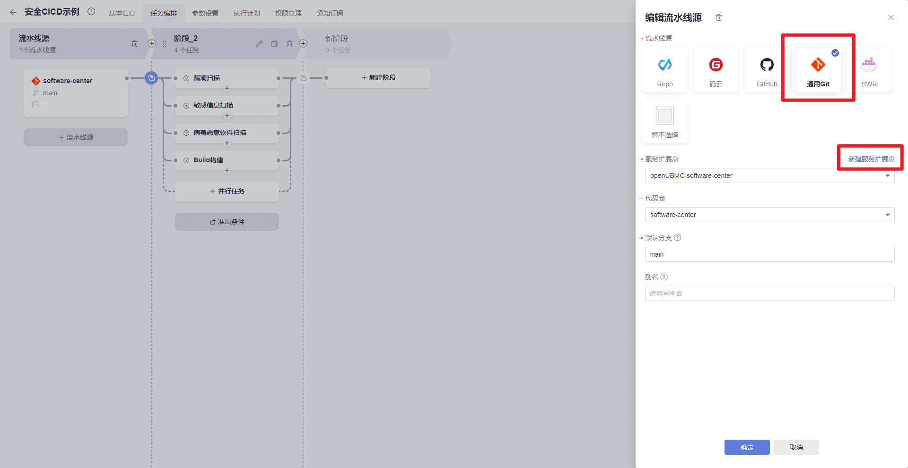
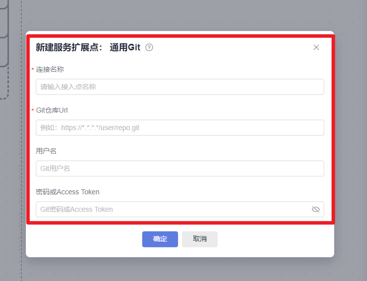
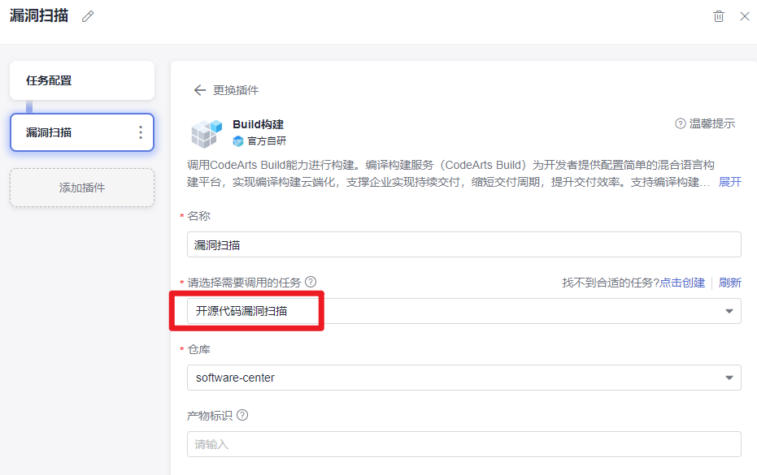
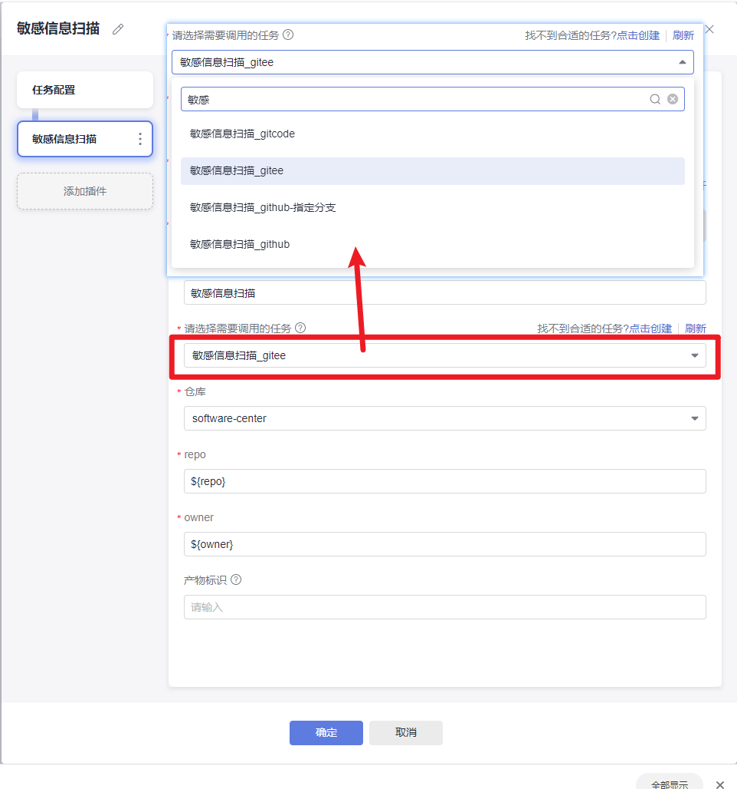
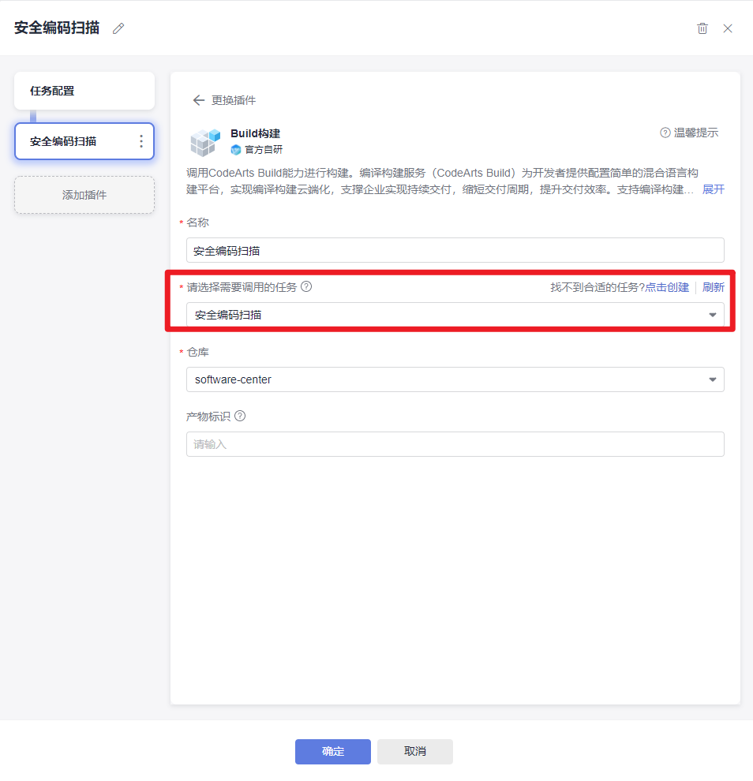
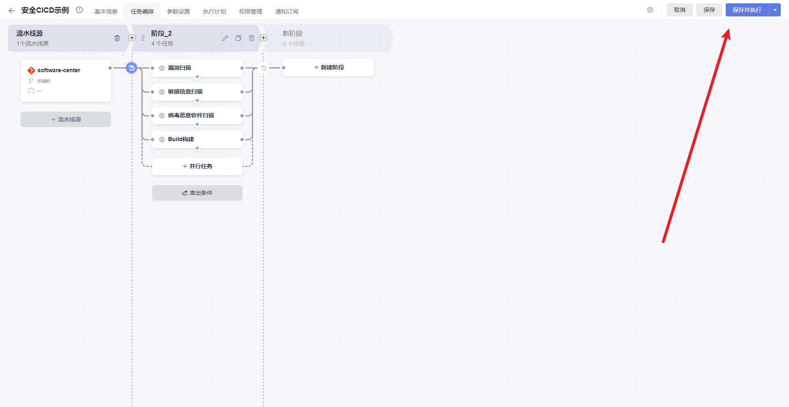
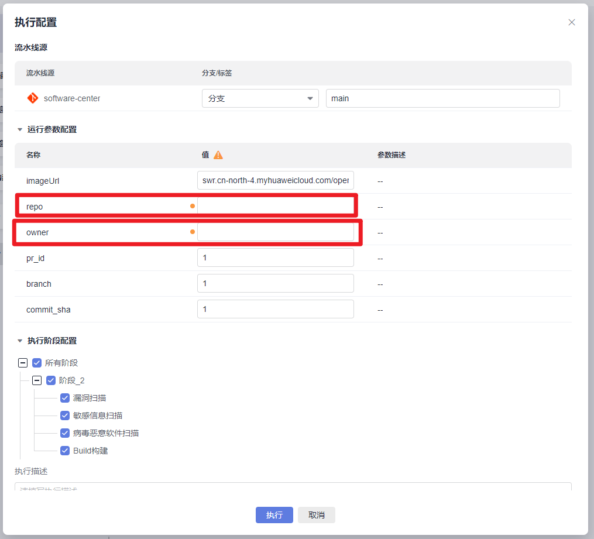

#### 1  Seninfo   主要用于扫描日志文件
把日志文件通过（邮件/git仓库等方式）在内网获取到之后
通过Seninfo上传开扫即可
#### 2  SecBinaryCheck
二进制包扫描工具  主要用来扫描开源漏洞
#### 3  Virus Scan
病毒扫描工具  勾选全部的病毒库  上传包来扫描即可
#### 4  BAS
是其中作用比较大的，集成了大量的脚本

#### 5 codearts流水线
- （1）进入CICD示例

- （2）点击编辑

- （3）将待扫描的仓库和分支信息同步过去
（3.1）新建服务扩展点

(3.2)编辑扩展点信息(暂不支持gitcode)
连接名称自定义，一般为仓库名称
用户名为gitee或github用户名
access token为设置的access token(可在deepseek查询如何设置access token)

- 4 配置任务信息
(4.1)漏洞扫描

(4.2)敏感信息扫描  根据需要扫描的代码仓所属平台进行选择

(4.3)安全编码扫描

- (5)  任务执行配置
(5.1) 点击保存并执行

(5.2)执行配置编辑

repo为待扫描的仓库名称
owner为待扫描的仓库的组织
最后点击执行即可
