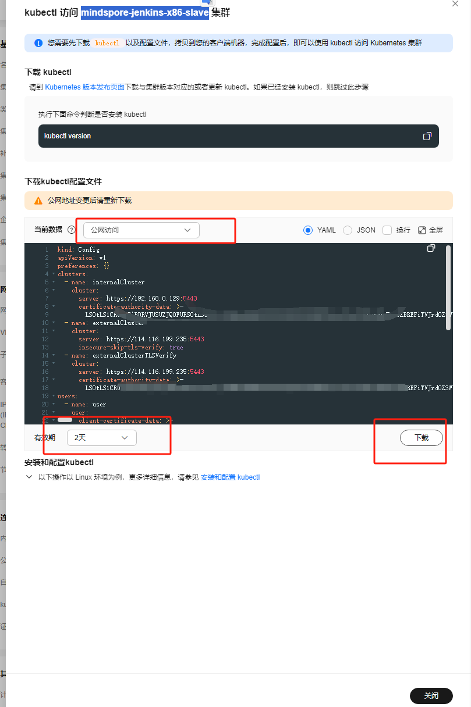
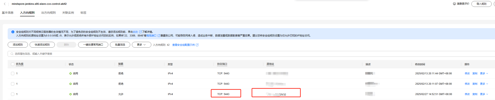
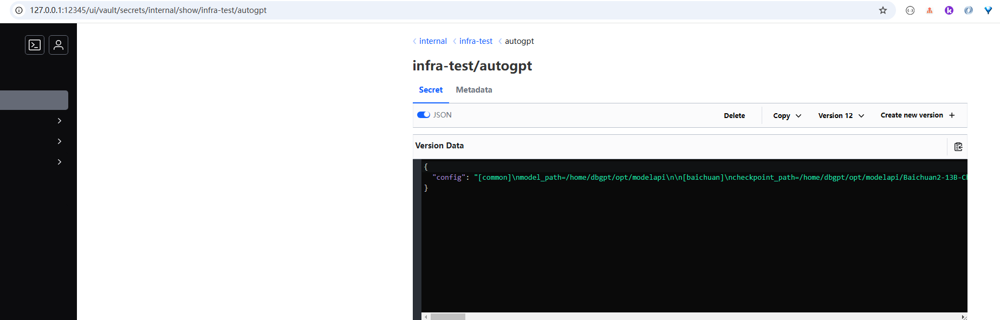

### 一、数据拉取
#### 1.环境准备

- 准备kubectl环境 略
- 登录CCE k8s 集群 下载kube 配置文件

- 安全组增加自己的EIP

- 完成端口映射 即可本地访问vault
 
` .\kubectl.exe port-forward vault-0 12345:8200 -n vault --kubeconfig .\.kube\config`

### 二、 跑拉取任务完成数据拉取

### 三、 识别安全问题 弱密码 等安全配置问题